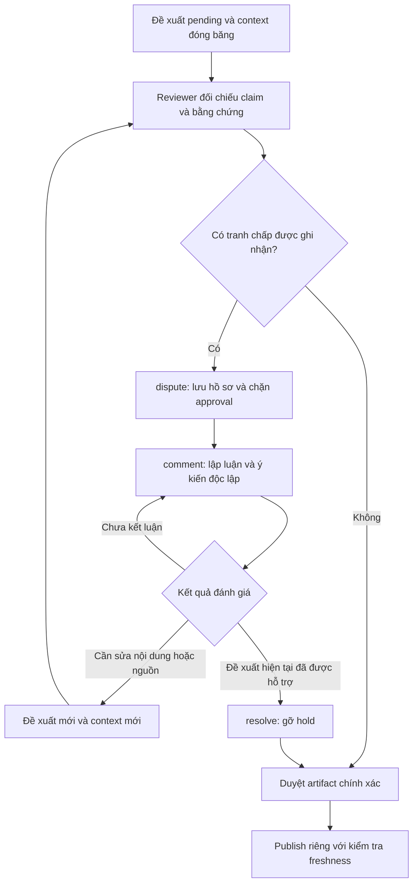

# Xử lý xung đột ngữ nghĩa: Wikipedia và áp dụng cho repo

**Trạng thái: MVP đã triển khai cho worker và playground; các giới hạn mở rộng vẫn được ghi rõ bên dưới.**

Nghiên cứu ngày 2026-09-16, lấy **English Wikipedia** làm tham chiếu; quy trình giữa các phiên bản ngôn ngữ có thể khác. Đã đọc [hội thoại được cung cấp](https://chatgpt.com/share/6aaa7dd5-f1d0-83ec-a60e-b27d21881623) và kiểm tra các chính sách gốc bên dưới. Đây là tài liệu thiết kế worker và workflow, không phải một bài wiki đã được duyệt.

## Kết luận

Cơ chế đáng học là chuyển bất đồng về câu chữ thành hồ sơ **claim → evidence → argument → resolution**. Wikipedia dùng thảo luận và chính sách để xác định nội dung có thể trình bày; không có thuật toán consensus quyết định chân lý. Đồng thuận không bắt buộc nhất trí, cũng không phải đếm phiếu. [Consensus](https://en.wikipedia.org/wiki/Wikipedia:Consensus).

Repo đã có nền tảng về tính toàn vẹn: đóng băng đề xuất, context snapshot, hash, reviewer khác tác giả, duyệt artifact chính xác và conditional write. Phần thiếu là một nơi lưu tranh chấp đang chờ cùng cơ chế chặn duyệt. Đề xuất bắt đầu từ phần đó, trước khi mở rộng thành hệ thống tranh chấp nhiều người/nhiều trang.

## Wikipedia có những giải pháp nào?

| Vấn đề | Cơ chế có sẵn | Giới hạn / bài học |
| --- | --- | --- |
| Hai người sửa cùng văn bản | MediaWiki phát hiện edit conflict để người sửa đối chiếu; Git có three-way merge | Hợp nhất văn bản không chứng minh hai phát biểu tương thích. [MediaWiki](https://www.mediawiki.org/wiki/Help:Edit_conflict), [Git merge](https://git-scm.com/docs/git-merge) |
| Bất đồng về nội dung | Thảo luận tại Talk trước khi mở rộng ra các kênh giải quyết tranh chấp | Phải lưu vấn đề, nguồn và lý do; sửa/revert liên tục không thay thế thảo luận. [Dispute resolution](https://en.wikipedia.org/wiki/Wikipedia:Dispute_resolution) |
| Một claim bị chất vấn | Người thêm/khôi phục phải cung cấp nguồn trực tiếp hỗ trợ cách viết | Có citation không đồng nghĩa citation hỗ trợ kết luận. [Verifiability](https://en.wikipedia.org/wiki/Wikipedia:Verifiability) |
| Hai nguồn khác nhau | Đánh giá độ tin cậy cho claim cụ thể; có Reliable Sources Noticeboard để xin ý kiến | Không có điểm uy tín tuyệt đối cho mọi phát biểu. [Reliable sources](https://en.wikipedia.org/wiki/Wikipedia:Reliable_sources) |
| Các quan điểm có cơ sở nhưng bất đồng | Attribution, diễn đạt trung lập, due weight theo nguồn đáng tin | Không chia đều 50/50 hoặc đếm số tài liệu sao chép cùng một nguồn. [NPOV](https://en.wikipedia.org/wiki/Wikipedia:Neutral_point_of_view) |
| Hai nguồn bị ghép thành kết luận mới | No Original Research ngăn synthesis không được nguồn hỗ trợ | A và B có nguồn không tự động chứng minh C. [NOR](https://en.wikipedia.org/wiki/Wikipedia:No_original_research) |
| Bế tắc giữa hai người | Third Opinion cung cấp góc nhìn độc lập, không ràng buộc | Vai trò là bổ sung lập luận; không phải trọng tài tự động chọn bên thắng. [Third opinion](https://en.wikipedia.org/wiki/Wikipedia:Third_opinion) |
| Cần thêm người đánh giá | DRN hỗ trợ thảo luận; RfC đặt câu hỏi trung lập để thu hút ý kiến bên ngoài | Đây không phải chuỗi escalation bắt buộc trong mọi vụ việc. [RfC](https://en.wikipedia.org/wiki/Wikipedia:Requests_for_comment), [DRN](https://en.wikipedia.org/wiki/Wikipedia:Dispute_resolution_noticeboard) |
| Cần kết luận thảo luận | Người đóng thảo luận cân nhắc lập luận theo chính sách và ghi kết quả | Không dùng ý thích cá nhân hoặc chỉ số phiếu. [Closing discussions](https://en.wikipedia.org/wiki/Wikipedia:Closing_discussions) |
| Chưa đạt đồng thuận | No consensus là kết quả hợp lệ; thay đổi thông thường thường giữ bản trước đề xuất | Có ngoại lệ theo loại nội dung; không suy ra bản cũ là đúng. Nguồn mới có thể làm thay đổi đồng thuận. [Consensus](https://en.wikipedia.org/wiki/Wikipedia:Consensus) |
| Revert qua lại hoặc phá rối | Edit-war controls, bảo vệ trang, biện pháp với hành vi | Quy tắc 3RR không cấp phép revert ba lần; BRD là essay hướng dẫn, không phải quy trình bắt buộc. [Edit warring](https://en.wikipedia.org/wiki/Wikipedia:Edit_warring), [BRD](https://en.wikipedia.org/wiki/Wikipedia:BOLD,_revert,_discuss_cycle) |
| Tranh chấp hành vi dai dẳng | Admin/ArbCom xử lý hành vi, không phán quyết sự thật của bài | Tách quyền vận hành khỏi đánh giá nội dung. [Arbitration policy](https://en.wikipedia.org/wiki/Wikipedia:Arbitration/Policy) |

Một hướng biểu diễn gần kề là **Wikidata**: qualifiers mô tả điều kiện/thời gian của statement; ranks phân biệt các giá trị được ưu tiên, bình thường hoặc deprecated. Đây là mô hình dữ liệu khác với văn bản Wikipedia; rank không phải điểm chứng minh sự thật. Repo có thể học cách ghi điều kiện ngay trong Markdown trước khi cần xây claim graph. [Qualifiers](https://www.wikidata.org/wiki/Help:Qualifiers), [Ranking](https://www.wikidata.org/wiki/Help:Ranking).

## Điều chỉnh cho wiki nội bộ

Các quyết định dưới đây là đề xuất thiết kế cho repo, không phải chính sách Wikipedia:

1. Phân biệt **mô tả thực tế**, **quy định đang có hiệu lực**, **đề xuất**. Với quy định nội bộ, tài liệu quyết định chính thức có thể là bằng chứng trực tiếp tốt nhất; không áp một thứ tự nguồn cố định cho mọi loại claim.
2. Tách ngày quan sát `YYYYMMDD-N` khỏi ngày hiệu lực. Một ghi chú mới hơn không mặc nhiên thay thế quy định cũ; cần chứng cứ về phạm vi và thẩm quyền thay thế.
3. Cùng tồn tại chỉ phù hợp khi cách viết có điều kiện rõ hoặc mô tả sự bất đồng. Runbook không thể đồng thời yêu cầu và cấm cùng thao tác trong cùng điều kiện.
4. Nếu phải quyết định hướng kiến trúc mới, người có thẩm quyền ban hành quyết định có lưu vết. Reviewer xác minh quyết định đó; không giả vờ nó là sự thật đã có từ các nguồn trước.
5. Giữ duyệt trước publish trong MVP. Gợi ý auto-publish theo rủi ro ở hội thoại tham chiếu là một thay đổi sản phẩm khác; một diff nhỏ như thêm chữ “không” vẫn có thể đảo ngược quy định.

## Luồng đề xuất



`pending/approved/rejected/published/stale` là vòng đời. `disputed` là thuộc tính độc lập: đề xuất có thể vừa pending, vừa bị tranh chấp, vừa có context stale. Không dùng một trạng thái duy nhất để che mất hai vấn đề khác nhau.

## Các phương án kiến trúc

| Phương án | Lợi ích | Chi phí / hạn chế | Đề xuất |
| --- | --- | --- | --- |
| Chỉ bổ sung mẫu review và Reason | Dùng ngay với convention hiện có; không đổi worker | Pending không cho biết đang chờ gì; thiếu hold và lịch sử thảo luận riêng | Phù hợp thử quy trình bằng tay |
| Thảo luận gắn với contribution | Tận dụng artifact/context bất biến, reviewer hiện có; dễ audit và chặn duyệt | Một tranh chấp xuyên nhiều contribution phải liên kết thủ công | **Ưu tiên cho MVP nếu triển khai** |
| Hồ sơ tranh chấp độc lập, liên kết nhiều contribution/trang | Một chủ đề có một hồ sơ; theo dõi qua nhiều lần sửa và sau publish | Cần quyền mở/đóng, quản lý phạm vi hold, kế thừa resolution và UI riêng | Bước sau nếu pilot có nhu cầu |
| Claim graph và phát hiện tự động | Có thể hỗ trợ tìm các phát biểu liên quan trên tập lớn | Cần chuẩn hóa claim, scope, negation và đánh giá sai số; vẫn cần người quyết định | Chưa chọn cho MVP |

Phương án thứ hai là một lựa chọn đánh đổi, không phải mô phỏng đầy đủ Talk của Wikipedia. Rủi ro lớn nhất là tranh chấp có thể bị bỏ sót khi tác giả gửi contribution mới. Trong MVP, yêu cầu liên kết predecessor và reviewer kiểm tra lịch sử cùng target; chưa tuyên bố ngăn được hành vi né hold bằng ID mới.

## Mô hình dữ liệu đề xuất

Giữ nguyên contribution và source context. Thêm log thảo luận chỉ ghi nối tiếp qua worker, mỗi sự kiện gắn với một contribution bất biến:

| Trường | Ý nghĩa |
| --- | --- |
| `contribution_id`, `bundle_hash` | Đề xuất chính xác đang được bàn |
| `sequence`, `actor`, `recorded_at` | Thứ tự sự kiện, người ghi, thời gian server |
| `action` | `open`, `comment`, `resolve`, `reopen` |
| `reason` | Hồ sơ lập luận có cấu trúc Markdown như mẫu dưới |
| `resolution_kind` | Khi resolve: `supported`, `scoped`, `attributed`, `not_a_conflict` |
| `related_contribution_ids` | Liên kết các phương án khác hoặc bản sửa kế tiếp, không tự cấp quyền hay propagate hold |

`no_consensus` là kết quả đánh giá có thể ghi trong comment, nhưng giữ hold mở. `request_revision` là yêu cầu sửa và liên kết bản mới; không giải phóng bản cũ để publish. Reviewer có thể reject bản cũ mà không gọi mâu thuẫn là đã giải quyết.

`discussion_version` bằng thứ tự sự kiện mới nhất. Decision phải tham chiếu version đã đọc. Nếu có entry mới trước approval, worker từ chối decision cũ dù bundle hash không thay đổi. Không cần tạo bảng claim toàn cục: trước mắt claim và bằng chứng được ghi trong một hồ sơ đọc được.

Mẫu hồ sơ:

```text
Question: Câu hỏi trung lập về nội dung cần quyết định
Claim A: Phát biểu nguyên văn + contribution/file/passage
Claim B: Phát biểu đối lập + contribution/file/passage
Scope: Đối tượng, môi trường, định nghĩa, đơn vị, thời gian hiệu lực
Evidence A/B: source path@version + hash đã capture + passage hỗ trợ
Alternatives: chọn / thu hẹp điều kiện / attribution / yêu cầu sửa
Objections: phản đối và cách trả lời từng điểm
Independent input: người đưa ý kiến, lý do, provenance
Outcome: kết luận hoặc no consensus
Next step: bằng chứng hoặc quyết định cụ thể còn thiếu
```

Nhắc một URL/tài liệu mới trong comment không biến nó thành frozen evidence. Nếu quyết định phụ thuộc vào nguồn mới, cần contribution mới có source context đó. Không tự động cập nhật nhãn version của bản cũ.

## Vai trò và quy trình quyết định

1. **Tác giả** nêu thay đổi, nguồn và các claim liên quan trong contribution; khi sửa phải giữ liên kết bản trước.
2. **Reviewer được cấu hình** đọc base/proposed/context, phân loại bất đồng và ghi hồ sơ. Người này có thể ghi ý kiến nhận từ tác giả hoặc chuyên gia, nhưng phải phân biệt người đưa ý kiến với người nhập log.
3. **Chuyên gia/người phụ trách lĩnh vực** giúp giải thích nguồn hoặc đưa ra quyết định trong thẩm quyền được tài liệu hóa. Đây là input có provenance, không phải phiếu tự động thắng.
4. **Reviewer độc lập với tác giả của bản cuối** kết luận theo evidence. Nếu reviewer tham gia tạo bản sửa, bản sửa cần reviewer khác; MVP không tự route người thay thế. Nếu chưa bố trí được reviewer độc lập, giữ pending.
5. **Worker** kiểm tra trạng thái, context, hash, hold và version thảo luận. Nó không đánh giá chất lượng nguồn hay tự tuyên bố đạt consensus.

Trình tự đánh giá: kiểm tra hai claim có cùng điều kiện không → đối chiếu nguồn trực tiếp và tính hiệu lực → cân nhắc cách viết giữ được phần hợp lệ → ghi phản đối chưa trả lời → xin input độc lập khi cần → resolve hoặc để pending/reject có lý do. Không áp thời gian chờ như một sự đồng ý mặc định.

## Hành vi UI/API của MVP

Các endpoint sau đã có trong worker:

| Thao tác | Hành vi MVP |
| --- | --- |
| Mở contribution | Hiển thị artifact, frozen sources, thảo luận, semantic status và `discussion_version` trong cùng response |
| Ghi thảo luận | `POST /api/contribution/ID/discussion` với actor, bundle hash, expected discussion version, action và hồ sơ lý do |
| Duyệt | Giữ endpoint review hiện có, bổ sung discussion version; approval chỉ hợp lệ khi không có hold mở |
| Queue | Hiển thị trạng thái vòng đời và nhãn Disputed riêng; có bộ lọc tranh chấp |
| CLI review | In cả hồ sơ và trạng thái tranh chấp trước khi ghi quyết định |
| Skill tải về | Kèm hướng dẫn phân loại và quyết định; không để link tham chiếu nội bộ bị thiếu khi dùng bên ngoài repo |

Màn hình reviewer ưu tiên ba vùng: **hai phát biểu và phạm vi**, **bằng chứng của từng phía**, **thảo luận và kết quả**. Có hành động “Mở tranh chấp”, “Thêm ý kiến”, “Ghi kết luận” và “Mở lại”; yêu cầu sửa dùng quyết định Reject kèm lý do cụ thể. “Không đủ cơ sở” để đề xuất pending và hiện rõ việc cần bổ sung; không buộc chọn một bên.

Nếu triển khai phương án MVP, configured reviewer là người ghi log qua tool; giữ mô hình trusted localhost hiện tại. Tác giả vẫn đóng góp bằng file, không thêm author submission API. Một Talk đa người cần thiết kế identity/quyền riêng trước khi mở endpoint cho người khác.

## Ràng buộc để không làm suy yếu workflow hiện có

- Resolve chỉ gỡ hold cho **đúng nội dung đã đóng băng**; không sửa artifact, không approve/publish.
- Wording hoặc evidence thay đổi → contribution mới, context mới, review mới. Reason dẫn ID trước và version thảo luận đã xử lý.
- Freshness được kiểm tra ở các điểm hiện có. `current` không chứng minh nội dung đúng; `resolved` cũng không chứng minh source còn current.
- Mỗi lần approve dùng cả artifact/bundle và phiên bản thảo luận đã đọc; entry đồng thời phải khiến reviewer đọc lại.
- Có thể reopen sau resolve trong khi contribution còn pending. Với bản approved/published, MVP dùng contribution sửa riêng; không âm thầm sửa approval cũ.
- Mỗi proposal có hold riêng. Reviewer phải nhận diện các proposal khác chịu ảnh hưởng; không tuyên bố bảo vệ xuyên toàn wiki.
- Lịch sử giữ cả phản đối lẫn kết luận. Backup cần chứa log cùng bundles, snapshots và decisions. SQLite do operator kiểm soát không phải kho chống sửa tuyệt đối.

## Ví dụ đánh giá

| Hai phát biểu | Phân tích cần làm | Kết quả phù hợp |
| --- | --- | --- |
| “Dùng Redis” / “Không dùng Redis” | Kiểm tra cache hay hệ lưu trữ chính; môi trường và quyết định gốc | Thu hẹp điều kiện nếu nguồn thực sự phân biệt hai trường hợp |
| “Thời hạn 30 ngày” / “Thời hạn 7 ngày” | Kiểm tra ngày hiệu lực và đối tượng của hai policy | Ghi rõ các giai đoạn/đối tượng, hoặc chọn policy thay thế có chứng cứ |
| “Benchmark X nhanh hơn” / “Nên thay toàn bộ hệ thống bằng X” | Kết luận thứ hai vượt phạm vi benchmark | Xin quyết định kiến trúc mới; không suy diễn thành quy định |
| Hai báo cáo cùng phạm vi cho kết quả khác nhau | Kiểm tra phương pháp, nguồn gốc và bất định | Ghi attribution trong trang mô tả; giữ runbook chờ quyết định nếu chưa có hướng hành động |
| Cần sửa đồng thời hai trang liên quan | Worker chỉ publish từng file; scope không tạo transaction | Thiết kế bước chuyển tiếp chính xác, lấy lại context giữa các lần publish |

## Giới hạn và bước tiếp theo

Phạm vi đề xuất là **reviewer-mediated discussion**, chưa phải Talk đa người. Reviewer ghi input và provenance của các bên; worker không tự mời chuyên gia, kiểm chứng lập luận hoặc bảo đảm reviewer vô tư về chuyên môn. Chỉ kiểm tra identity khác tác giả chưa đủ để chứng minh độc lập.

Theo thiết kế MVP, hold gắn với một contribution pending; không tự lan sang contribution khác hoặc trang đã publish. Muốn xử lý tranh chấp sau publish cần đề xuất sửa/cảnh báo riêng. Log không đóng băng nguồn mới được nhắc đến trong comment và không chống quản trị viên sửa trực tiếp SQLite. Phải đưa bằng chứng mới vào context của đề xuất kế tiếp nếu dùng nó làm cơ sở quyết định.

Không tự phát hiện mâu thuẫn xuyên tài liệu. Khi pilot có tranh chấp tái diễn, đo số vụ, tuổi pending, thời gian giải quyết, tỉ lệ mở lại và số lỗi sau publish. Dựa vào dữ liệu đó mới cân nhắc hồ sơ tranh chấp dùng chung nhiều contribution, quyền góp ý riêng, domain routing hoặc hỗ trợ AI tìm claim cần kiểm tra. Đây là các bước tương lai, chưa triển khai.

## Tiêu chí chấp nhận của MVP

1. Hai claim trái nghĩa vẫn mở được tranh chấp dù không trùng dòng và sources đều current.
2. Hold mở chặn approval qua cả UI, API và CLI; comment/no consensus không gỡ hold.
3. Resolve không thay đổi artifact và không tự publish; rejection vẫn thực hiện được khi còn hold.
4. Thảo luận mới làm decision cũ thất bại; hai ghi đồng thời cùng version không ghi đè nhau.
5. Restart/backup giữ toàn bộ log và semantic status; lịch sử phản đối vẫn đọc được sau reject/publish.
6. Tác giả không tự resolve hoặc approve; tên actor được áp dụng theo trusted boundary hiện tại.
7. Nguồn đổi sau resolve vẫn làm approval/publication thất bại theo freshness guard.
8. Contribution mới cần nội dung/context mới và dẫn predecessor; bài test không giả định hold tự lan giữa các ID.
9. Ví dụ Redis khác phạm vi được thu hẹp điều kiện; hai quy định cùng phạm vi không được giải bằng cách đặt hai câu cạnh nhau.

## Phạm vi cần chốt trước khi triển khai

Đề xuất duyệt **thảo luận theo contribution + hold + log + review version guard** làm bước đầu. Tạm giữ manual input từ chuyên gia, quyết định bởi configured reviewer, và correction qua proposal mới sau publish. Nếu yêu cầu bắt buộc là một tranh chấp theo claim tồn tại xuyên nhiều contribution hoặc có thể đóng băng nội dung đã approved, cần chọn hồ sơ tranh chấp độc lập ngay từ đầu và thiết kế thêm phạm vi hold, quyền thu hồi approval, cùng quy trình chuyển tiếp.
